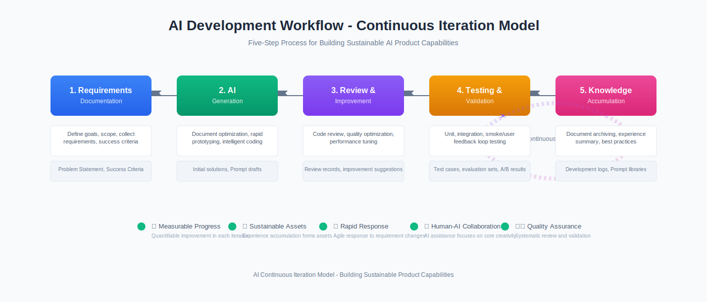

> This is a practical guide for product and technical teams, introducing how to build an actionable, measurable, and sustainable AI continuous iteration model based on the "AI Development Five-Step Workflow," enabling teams to steadily improve quality and efficiency while rapidly experimenting.

*Figure: AI Development Five-Step Workflow (Requirements Documentation → AI Generation → Review & Improvement → Testing & Validation → Knowledge Accumulation) forms a closed loop through the "♻️ Continuous Iteration Cycle".*

## Why We Need a "Continuous Iteration Model"

- **Faster Requirement Changes**: AI-driven product forms evolve rapidly, and traditional linear processes are not agile enough to respond.
- **Unstable Quality**: Model outputs are inherently uncertain and require systematic review and validation.
- **Difficulty in Knowledge Accumulation**: Experience often remains scattered in chats and code snippets, resulting in low reuse rates and repetitive work.

The goal of the continuous iteration model is to transform "experiment → improve → validate → accumulate → re-experiment" into a measurable, governed flywheel, where each iteration contributes reusable assets and quantifiable improvements.

## Five-Step Workflow Overview

### 1. Requirements Documentation (Define Goals, Scope, Collect Requirements)
- **Deliverables**: Problem Statement, Success Criteria, Constraints & Assumptions, Milestones.
- **Recommended Templates**: PRD-Light (1-page version) or Issue Cards + Acceptance Criteria.

### 2. AI Generation (Document Optimization, Rapid Prototyping, Intelligent Coding)
- **Deliverables**: Initial solutions/code/Prompt drafts/data processing scripts.
- **Key Points**: Structured prompts (instruction-context-example-constraints), diverse generation (Top-K/different approaches).

### 3. Review & Improvement (Code Review, Quality Optimization, Performance Tuning)
- **Deliverables**: Review records, improvement suggestions, refactoring lists, risk assessments.
- **Key Points**: Human-AI collaborative review (colleagues + AI review), clear rejection criteria (risk control/compliance/security).

### 4. Testing & Validation (Unit, Integration, Smoke/User Feedback Loop)
- **Deliverables**: Automated test cases, evaluation sets (Eval), A/B results, defect lists.
- **Key Points**: Integrate LLM evaluation into CI (consistency, robustness, toxicity/bias detection, hallucination rate).

### 5. Knowledge Accumulation (Document Archiving, Experience Summary, Best Practices)
- **Deliverables**: Development logs, Prompt libraries, evaluation datasets, retrospective reports, RAG knowledge base entries.
- **Key Points**: Accumulation not only records "results" but emphasizes "process decisions, failure lessons, use case coverage".

## How the Flywheel Spins: From Accumulation Back to Requirements

- **Accumulation → Requirements**: Structure retrospective and evaluation conclusions back into requirements documentation, updating success criteria and boundaries.
- **Requirements → Generation**: Optimize prompts and enhance data based on the latest knowledge base, reducing ineffective attempts.
- **Generation → Review/Testing**: Form a "automatic + manual" dual insurance mechanism to quickly identify degradation and risks.
- **Metrics-Driven**: Each flywheel cycle delivers quantifiable improvements (evaluation scores, coverage rates, release frequency).

This mechanism enables teams to iterate based on data rather than "gut feelings," steadily evolving through persistent assets and data feedback loops.

## Measurable Core Metrics (Examples)

- **Delivery Efficiency**: Lead time from requirements to validation, weekly release frequency, automated test pass rate.
- **Output Quality**: LLM evaluation scores (accuracy, consistency, robustness), defect escape rate.
- **Reliability & Security**: Sensitive content trigger rate, compliance check pass rate, abnormal rollback frequency.
- **Knowledge Assets**: Number of new valid use case entries, Prompt reuse rate, evaluation set coverage and evolution speed.

Recommend regularly generating "Iteration Health Reports" in CI to track trends and anomalies in key metrics.

## Implementation Checklist for Each Step

### 1. Requirements Documentation
- **Templates**: Goals/user stories/acceptance criteria (Given-When-Then)/constraints/risks/metrics.
- **Methods**: Incorporate historical failure cases and boundary conditions into "negative use case sets" to avoid repeating mistakes.

### 2. AI Generation
- **Prompt Design**: Instruction structure, input/output formats (JSON/YAML), chain-of-thought and self-evaluation requirements.
- **Diversity**: Encourage generating multiple solutions with scoring (Self-Consistency), keep top three for review.

### 3. Review & Improvement
- **Human Review**: Peer review + domain expert sampling; define clear "reject/revise/approve" criteria.
- **AI Review**: Static analysis, code smells, complexity and security checks, Prompt anti-pattern detection.

### 4. Testing & Validation
- **Automation**: Unit/integration/end-to-end; LLM-specific evaluations (adversarial samples, long-tail use cases).
- **Regression Monitoring**: Incorporate key evaluation items into pre/post-release baseline comparisons to prevent model degradation.

### 5. Knowledge Accumulation
- **Structured Archiving**: Development logs, decision records, failure reasons, alternative solutions, impact assessments.
- **Knowledge Base Maintenance**: Index high-value Prompts, use cases, and evaluation samples into RAG, with versioning.

## Mini Case Study: Building "Intelligent Customer Service Q&A" Iteration Flywheel

**Scenario**: Improve FAQ Q&A accuracy and response consistency.

1. **Requirements**: Define goals (Top-1 hit rate ≥85%, reject without speculation), scope, and acceptance criteria.
2. **Generation**: Generate response strategies and multiple Prompt versions based on existing knowledge base and historical conversations.
3. **Review**: Human comparison + AI scoring, filter out over-promises and inconsistent results, record improvement points.
4. **Testing**: Build evaluation sets (high-frequency questions + long-tail + adversarial samples), integrate into CI; pre/post-release comparison.
5. **Accumulation**: Add high-quality Q&A samples, failure samples, and correction strategies to knowledge base, update requirement boundaries.

**Results**: After three iterations: hit rate improved from 72% → 84% → 88%, rejection compliance rate from 78% → 92%.

## Team Collaboration and Governance Recommendations

- **Role Division**: Product (define goals and metrics), AI Engineering (generation/optimization), QA (evaluation/baseline).
- **Review System**: Weekly retrospectives + periodic evaluation releases; reject "gut-feeling" deployments without metrics.
- **Toolchain**: Issue/PR templates, evaluation platforms, RAG knowledge base, CI (including LLM Eval steps).
- **Risk & Compliance**: Establish sensitive content and security checklists, set automatic blocking and manual review gates.

## One-Page Implementation Checklist (Ready to Use)

- [ ] Requirement cards include goals/acceptance criteria/metrics/risks & constraints
- [ ] Generation phase produces ≥3 alternative solutions with scoring records
- [ ] Review records include rejection criteria and key improvement points
- [ ] Testing includes automation + LLM-specific evaluation with baseline comparison
- [ ] Knowledge accumulation entries (Prompts/use cases/evaluation samples/retrospectives)
- [ ] Weekly health reports (efficiency/quality/security/assets four dimensions)

## Conclusion

The key to the AI continuous iteration model is not "speed" but "sustainability and reusability." Using the "five-step process + flywheel loop + metrics governance" transforms each attempt into an asset and each release into progress. Let team creativity and engineering capabilities grow stronger through the compound interest of data and knowledge.

---

*This article is based on practical project experience, aiming to provide actionable continuous iteration methodology for AI product development teams. Feel free to share your practical experiences and improvement suggestions in the comments.*