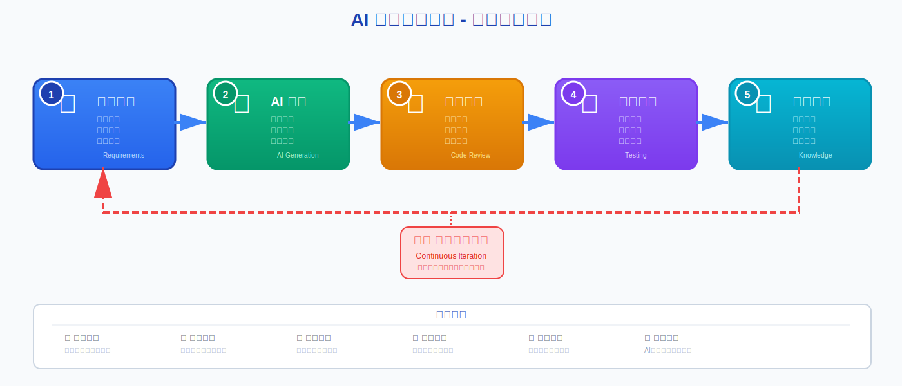

> 这是一篇面向产品与技术团队的实战指南，介绍如何基于"AI 开发五步工作流程"构建一套可落地、可度量、可持续进化的 AI 持续迭代模型，让团队在快速试错的同时稳步提升质量与效率。

*图：AI 开发五步工作流程（需求文档 → AI 生成 → 审查改进 → 测试验证 → 知识沉淀），通过"♻️ 持续迭代循环"形成闭环。*

## 为什么需要"持续迭代模型"

- **需求变化更快**：AI 驱动的产品形态更新迅速，传统线性流程响应不够敏捷。
- **质量不易稳定**：模型输出具有不确定性，需要体系化的审查与验证。
- **知识难以沉淀**：经验常散落在聊天与代码片段中，复用率低、重复劳动多。

持续迭代模型的目标，是把"试验—改进—验证—沉淀—再试验"变成有度量、有治理的飞轮，让每一次迭代都贡献可复用的资产和可量化的改进幅度。

## 五步工作流程概览

### 1. 需求文档（明确目标、定义范围、收集需求）
- **输出物**：问题陈述（Problem Statement）、成功标准（Success Criteria）、约束与假设、里程碑。
- **建议模板**：PRD-Light（1页版）或任务卡（Issue）+验收条件（AC）。

### 2. AI 生成（文档优化、快速原型、智能编码）
- **输出物**：初版方案/代码/Prompt草稿/数据处理脚本。
- **要点**：结构化提示（指令—上下文—示例—限制）、多样性生成（Top-K/不同思路）。

### 3. 审查改进（代码审查、质量优化、性能调优）
- **输出物**：Review记录、改进建议、重构清单、风险评估。
- **要点**：人机协同审查（同事+AI 审阅）、明确拒绝标准（风控/合规/安全）。

### 4. 测试验证（单元、集成、冒烟/用户回路）
- **输出物**：自动化测试用例、评测集（Eval）、A/B 结果、缺陷清单。
- **要点**：将 LLM 评测纳入 CI（一致性、鲁棒性、毒性/偏见检测、Hallucination 率）。

### 5. 知识沉淀（文档归档、经验总结、最佳实践）
- **输出物**：开发日志、Prompt库、评测数据集、复盘报告、RAG 知识库条目。
- **要点**：沉淀不仅记录"结果"，更强调"过程决策、失败教训、用例覆盖"。

## 飞轮如何转起来：从沉淀回流到需求

- **沉淀 → 需求**：将复盘与评测结论结构化回写至需求文档，更新成功标准与边界。
- **需求 → 生成**：基于最新知识库进行 Prompt 优化与数据增强，减少无效尝试。
- **生成 → 审查/测试**：形成"自动+人工"的双保险，快速定位退化与风险。
- **指标驱动**：每一圈飞轮都有可量化改进（如评测分数、覆盖率、发布频率）。

这套机制使团队不再"凭感觉"迭代，而是通过持久资产与数据闭环稳步进化。

## 可度量的核心指标（示例）

- **交付效率**：从需求到验证的 Lead Time、每周发布次数、自动化测试通过率。
- **输出质量**：LLM 评测得分（准确性、一致性、鲁棒性）、缺陷逃逸率。
- **可靠性安全**：敏感内容触发率、规范/合规检查通过率、异常回滚次数。
- **知识资产**：新增有效用例条目数、Prompt 重用率、评测集覆盖率与演进速度。

建议在 CI 中定期出具"迭代健康度报表"，追踪关键指标的趋势与异常波动。

## 每一步怎么落地（实操清单）

### 1. 需求文档
- **模板**：目标/用户故事/验收条件（Given-When-Then）/约束/风险/度量指标。
- **方法**：将历史失败案例与边界条件纳入"负面用例集"，避免重复踩坑。

### 2. AI 生成
- **Prompt 设计**：指令化结构、输入输出格式（JSON/YAML）、思维链与自评要求。
- **多样性**：鼓励生成多解并评分（Self-Consistency），保留前三名进入审查。

### 3. 审查改进
- **人工审查**：同伴评审 + 领域专家抽样；明确"拒绝/修正/通过"标准。
- **AI 审查**：静态分析、代码异味、复杂度与安全检查、Prompt 反模式发现。

### 4. 测试验证
- **自动化**：单元/集成/端到端；LLM 专项评测（对抗样本、长尾用例）。
- **回归监控**：将关键评测项纳入发布前后基线比对，防止模型退化。

### 5. 知识沉淀
- **结构化存档**：开发日志、决策记录、失败原因、替代方案、影响评估。
- **知识库维护**：将高价值 Prompt、用例与评测样本进入 RAG 索引，并版本化。

## 迷你实战：构建"智能客服问答"迭代飞轮

**场景**：提升 FAQ 问答的准确率与回复一致性。

1. **需求**：明确目标（Top-1 命中率≥85%、拒答不妄言）、覆盖范围与验收标准。
2. **生成**：基于现有知识库与历史对话生成答复策略与多版本 Prompt。
3. **审查**：人工对比 + AI 评分，筛除过度承诺与不一致结果，记录改进点。
4. **测试**：构建评测集（高频问题+长尾+对抗样本），纳入 CI；发布前后对比。
5. **沉淀**：将高质量问答样本、失败样本及修正策略进入知识库，更新需求边界。

**成果**：经过三轮迭代：命中率从 72% → 84% → 88%，拒答规范通过率从 78% → 92%。

## 团队协作与治理建议

- **角色分工**：产品（定义目标与度量）、AI 工程（生成/优化）、QA（评测/基线）。
- **评审制度**：每周复盘会 + 阶段性评测发布；拒绝无度量的"拍脑袋上线"。
- **工具链**：Issue/PR 模板、评测平台、RAG 知识库、CI（含 LLM Eval 步骤）。
- **风险与合规**：建立敏感内容与安全检查清单，设置自动阻断与人工复核闸门。

## 一页落地清单（可直接复制使用）

- [ ] 需求卡片含目标/验收条件/度量指标/风险与约束
- [ ] 生成阶段产出≥3个可选方案与评分记录
- [ ] 审查记录含拒绝标准与关键改进点
- [ ] 测试包含自动化+LLM 专项评测与基线对比
- [ ] 知识沉淀以条目化入库（Prompt/用例/评测样本/复盘）
- [ ] 每周健康度报表（效率/质量/安全/资产四维）

## 总结

AI 持续迭代模型的关键不在"快"，而在"可持续可复用"。用"五步流程+飞轮闭环+指标治理"把每一次尝试变成资产，每一次发布变成进步。让团队的创造力与工程力在数据与知识的复利中，越迭代越强。

---

*本文基于实际项目经验总结，旨在为AI产品开发团队提供可落地的持续迭代方法论。欢迎在评论区分享您的实践经验和改进建议。*