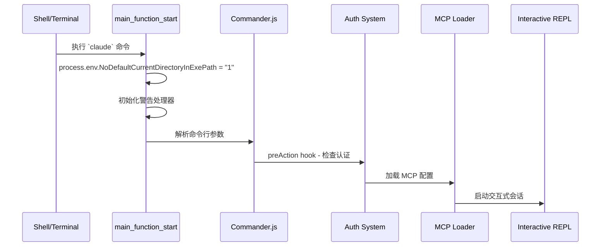
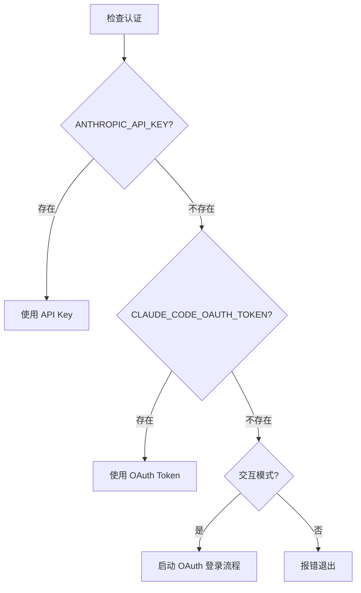
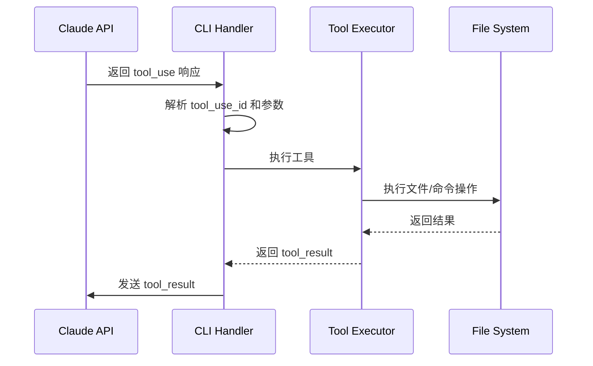
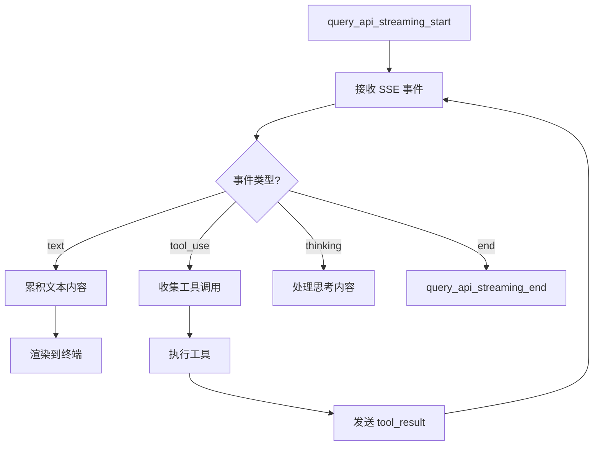

## 前言

Claude Code CLI 作为 Anthropic 推出的 AI 编程助手工具，其 v2.1.2 版本展现了现代 AI 工具链的复杂架构设计。本文基于对 `cli.formatted.js`（609,962 行混淆代码）的深度逆向分析，揭示其从启动到工具执行的完整技术架构。

## 整体架构概览

```mermaid
flowchart TD
    A[Shell/Terminal] --> B[主入口函数 Eq7()]
    B --> C[Commander.js 解析]
    C --> D[认证系统检查]
    D --> E[MCP 配置加载]
    E --> F{运行模式}
    F -->|Interactive| G[REPL 交互模式]
    F -->|--print| H[非交互打印模式]
    F -->|mcp serve| I[MCP Server 模式]
    G --> J[Anthropic API]
    H --> J
    J --> K[工具执行系统]
    K --> L[文件系统/命令执行]
    L --> M[响应输出]
```

## 1. 启动流程分析

### 1.1 主入口与客户端检测

CLI 启动时首先进行环境检测和客户端类型识别，支持多种集成场景：

- **GitHub Actions**：当检测到 GitHub Actions 环境时自动适配
- **SDK 集成**：支持 TypeScript、Python、CLI 等多种 SDK 入口
- **VS Code 扩展**：专门的 VSCode 集成模式
- **远程会话**：支持 WebSocket 和会话令牌的远程连接
- **标准 CLI**：默认的命令行交互模式

这种设计体现了产品的生态化思维，可以在不同平台和环境中无缝运行。

### 1.2 启动序列



**关键时序节点：**
- `run_commander_initialized`: Commander.js 初始化完成
- `preAction_start`: 认证检查开始  
- `action_mcp_configs_loaded`: MCP 配置加载完成

## 2. 认证与授权机制

### 2.1 多层认证体系

Claude CLI 实现了灵活的认证来源优先级：



认证优先级从高到低为：环境变量中的 ANTHROPIC_API_KEY、OAuth 令牌、交互式登录流程。这种设计确保了在不同使用场景下都能提供合适的认证方式。

### 2.2 权限管理模式

支持三种权限模式：
- `default` - 默认模式（完整权限检查）
- `bypassPermissions` - 跳过所有权限检查
- `enterprise` - 企业托管模式

## 3. API 交互流程

### 3.1 消息创建 API 调用点

分析发现 **7 个关键 API 调用位置**，展现了不同的使用场景：

| 上下文 | 类型 |
|--------|------|
| `this.client.beta.messages.create` | 迭代器模式 |
| 标准消息创建 | 同步/异步 |
| 带重试机制 | 容错处理 |
| Vertex/Bedrock | 多云支持 |
| 流式响应 | Streaming |
| 工具调用响应 | Tool Use |
| 最终响应 | Return |

### 3.2 多云架构支持

API 调用支持三大云提供商：
- **Anthropic**：原生 API
- **AWS Bedrock**：亚马逊云服务
- **Google Vertex**：谷歌云平台

这种设计为企业和不同地区的用户提供了灵活的部署选择。

## 4. 工具系统设计

### 4.1 内置工具矩阵

| 工具名称 | 功能 |
|----------|------|
| **Bash** | 执行 Shell 命令 |
| **Edit** | 编辑文件 |
| **Write** | 写入文件 |
| **Read** | 读取文件 |
| **NotebookEdit** | 编辑 Notebook |
| **LocalBashTask** | 本地 Bash 任务 |
| **AgentOutputTool** | Agent 输出 |

### 4.2 Bash 工具的安全设计

CLI 实现了智能的沙箱模式切换机制，根据运行环境自动选择合适的 Bash 工具类型。在安全敏感的环境中会使用沙箱版本的 Bash 工具来隔离潜在的风险操作。

权限检查机制会验证每个 Bash 命令是否在允许的权限范围内，如果发现未授权的命令执行尝试，会返回相应的错误信息并记录审计日志。

### 4.3 工具调用流程



**tool_use 处理核心逻辑：**

CLI 会过滤出所有的工具调用请求，为每个工具调用分配唯一的 ID，并在执行完成后将结果封装成标准化的响应格式返回给 API。这种机制确保了工具调用的可靠性和可追溯性。

## 5. 流式响应处理

### 5.1 流式事件类型

CLI 定义了丰富的流式事件类型来处理不同类型的响应内容，包括文本输出、工具调用、思考过程等。这种分类机制使得 CLI 能够智能地处理各种响应场景，提供流畅的用户体验。

### 5.2 流式处理架构



CLI 采用特性开关来控制流式工具执行的启用状态，这表明 Claude CLI 采用了渐进式特性发布机制，可以在生产环境中安全地测试和推出新功能。

## 6. MCP 协议集成

### 6.1 配置加载优先级

1. `--mcp-config` 命令行参数
2. 企业配置 (Enterprise MCP)
3. 项目配置 (`.mcp.json`)
4. 用户配置 (`~/.claude/mcp.json`)

### 6.2 服务器类型支持

| 类型 | 描述 |
|------|------|
| `sdk` | SDK 类型服务器 |
| `command` | 标准命令服务器 |
| `enterprise` | 企业配置服务器 |

**配置解析逻辑：**

CLI 会对配置内容进行预处理，包括去除空白字符、验证格式有效性，并根据不同的配置来源（命令行、企业配置、项目配置、用户配置）应用相应的解析策略。配置解析还支持环境变量展开和动态作用域处理。

## 7. 权限管理深度分析

### 7.1 工具权限配置语法

支持精细化的权限规则：
- `"Bash(npm run:*)"` - 前缀匹配
- `"Bash(npm run *)"` - 通配符匹配
- `"Bash(npm:*)"` - 命令前缀
- `"Bash"` - 允许所有命令

### 7.2 文件系统权限控制

CLI 实现了细粒度的文件系统权限控制，通过白名单和黑名单机制来管理文件的读写权限。管理员可以精确指定哪些路径允许写入、哪些路径禁止访问，从而在提供便利性的同时确保系统安全。

## 8. 关键技术洞察

### 8.1 架构优势

1. **多模式设计**：支持交互式、批处理、SDK 集成等多种运行模式
2. **企业级特性**：多云部署、MCP 协议、细粒度权限控制
3. **可扩展性**：通过 MCP 和 Agent 系统支持自定义扩展
4. **安全性**：完整的认证和权限控制机制

### 8.2 技术选型分析

| 依赖 | 用途 | 技术考量 |
|------|------|----------|
| **Commander.js** | CLI 框架 | 轻量、成熟、生态丰富 |
| **RxJS** | 响应式编程 | 处理复杂的异步流 |
| **Ink (React)** | 终端 UI | 现代化终端界面开发 |
| **highlight.js** | 代码高亮 | 语法高亮标准解决方案 |
| **chalk** | 终端颜色 | 跨平台颜色支持 |

### 8.3 性能优化策略

1. **流式处理**：避免等待完整响应，提升用户体验
2. **Feature Flag**：渐进式特性发布，降低风险
3. **重试机制**：网络不稳定时的容错处理
4. **沙箱隔离**：安全的工具执行环境

## 9. 会话管理

### 9.1 会话持久化

CLI 对会话 ID 进行严格的 UUID 格式验证，确保会话标识符的有效性。如果提供的会话 ID 格式不正确，CLI 会立即报错并退出，防止无效的会话恢复尝试破坏工作流程。

### 9.2 会话恢复选项

- `--continue`：继续最近会话
- `--resume [id]`：恢复指定会话
- `--fork-session`：分叉会话（新 ID）
- `--no-session-persistence`：禁用持久化

## 总结与展望

Claude Code CLI v2.1.2 展现了现代 AI 编程工具的复杂架构设计，其核心特点包括：

### 关键成就

1. **模块化架构**：清晰的职责分离，便于维护和扩展
2. **安全优先**：多层次权限控制和沙箱机制
3. **生态兼容**：支持 MCP 协议，可扩展工具生态
4. **多云战略**：支持主流云平台，满足企业需求

### 技术启示

1. **渐进式特性发布**：通过 Feature Flag 控制新功能推出
2. **配置分层管理**：从命令行到用户配置的优先级设计
3. **流式优先**：实时响应提升用户体验
4. **安全第一**：细粒度权限控制保障系统安全

### 未来演进方向

基于当前架构分析，Claude CLI 可能的演进方向：

1. **更强的本地推理**：减少对云端 API 的依赖
2. **插件市场**：基于 MCP 协议的插件生态系统
3. **协作功能**：多用户实时协作编程
4. **垂直领域优化**：针对特定编程语言或框架的专门优化

Claude Code CLI 不仅是一个 AI 编程工具，更是现代软件工程工具链设计的重要参考案例。其架构思想和技术实现值得 AI 工具开发者深入研究和借鉴。

---

**分析基础**：基于 Claude cli.js Version 2.1.2，`cli.formatted.js` (609,962 行)
**分析方法**：逆向工程 + 代码结构分析 + 执行流程追踪
**分析日期**：2026-01-09

> **声明**：由于代码经过混淆处理，变量和函数名均为随机生成。本分析基于代码结构、字符串常量和执行流程推导，可能与实际实现存在差异。