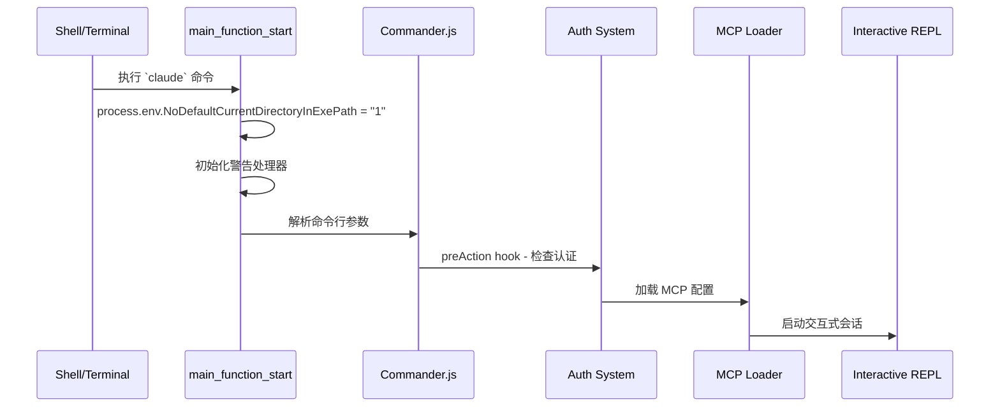
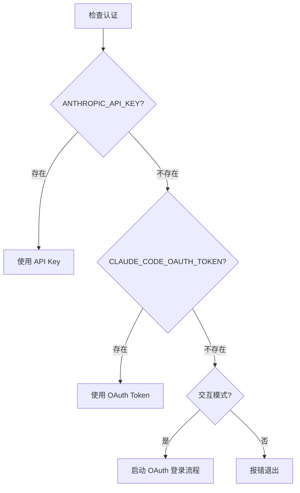
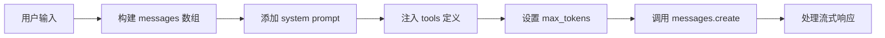
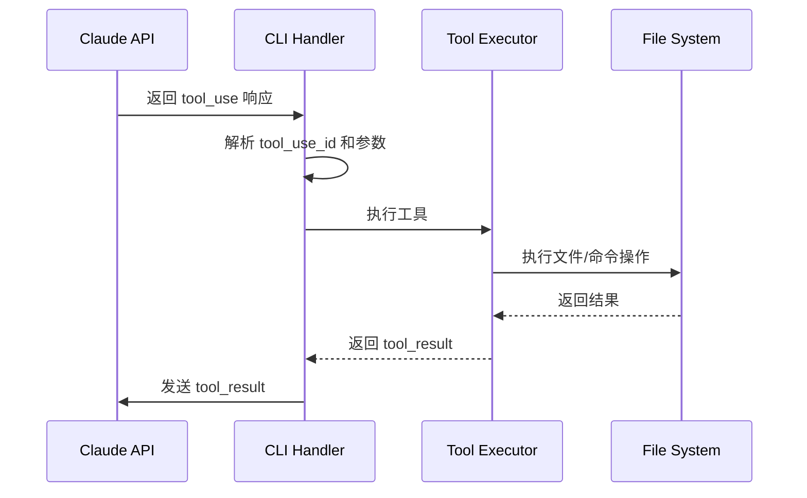
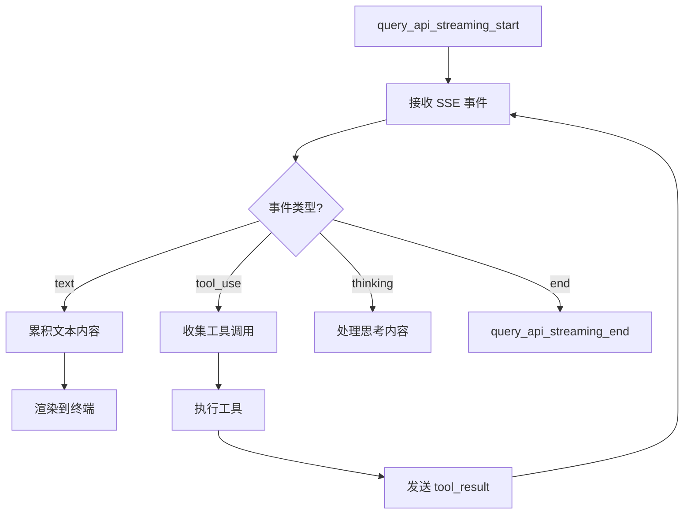

# Claude Code CLI 详细代码流程分析报告

> **版本**: 2.1.2  
> **分析日期**: 2026-01-09  
> **源文件**: `cli.formatted.js` (609,962 行)

---

## 目录

1. [启动流程](#1-启动流程)
2. [认证与授权](#2-认证与授权)
3. [API 交互流程](#3-api-交互流程)
4. [工具系统](#4-工具系统)
5. [流式响应处理](#5-流式响应处理)
6. [MCP 协议集成](#6-mcp-协议集成)
7. [权限管理](#7-权限管理)
8. [会话管理](#8-会话管理)
9. [关键代码位置索引](#9-关键代码位置索引)

---

## 1. 启动流程

### 1.1 主入口函数



**关键代码位置:**
| 功能 | 行号 | 描述 |
|------|------|------|
| `main_function_start` | 606582 | 主函数入口 |
| `run_commander_initialized` | 606674 | Commander.js 初始化完成 |
| `preAction_start` | 606676 | 认证检查开始 |
| `action_mcp_configs_loaded` | 607231 | MCP 配置加载完成 |

### 1.2 客户端类型检测

```javascript
// 行 606598-606612
if (process.env.GITHUB_ACTIONS === "true") return "github-action";
if (process.env.CLAUDE_CODE_ENTRYPOINT === "sdk-ts") return "sdk-typescript";
if (process.env.CLAUDE_CODE_ENTRYPOINT === "sdk-py") return "sdk-python";
if (process.env.CLAUDE_CODE_ENTRYPOINT === "sdk-cli") return "sdk-cli";
if (process.env.CLAUDE_CODE_ENTRYPOINT === "claude-vscode") return "claude-vscode";
if (process.env.CLAUDE_CODE_SESSION_ACCESS_TOKEN || 
    process.env.CLAUDE_CODE_WEBSOCKET_AUTH_FILE_DESCRIPTOR) return "remote";
return "cli";
```

---

## 2. 认证与授权

### 2.1 认证来源优先级



**关键代码位置:**
| 功能 | 行号 |
|------|------|
| API Key 检查 | 168714-168756 |
| API Key 验证函数 `iw()` | 168746 |
| OAuth Token 处理 | 552364-552469 |
| 认证错误提示 | 168731 |

### 2.2 API Key 验证

```javascript
// 行 168714-168736
if (Dv0() && process.env.ANTHROPIC_API_KEY) {
    return {
        key: process.env.ANTHROPIC_API_KEY,
        source: "ANTHROPIC_API_KEY"
    };
}
```

---

## 3. API 交互流程

### 3.1 消息创建 API 调用

**所有 `messages.create` 调用位置:**

| 行号 | 上下文 | 类型 |
|------|--------|------|
| 258592 | `this.client.beta.messages.create` | 迭代器模式 |
| 318895 | 标准消息创建 | 同步/异步 |
| 468953 | 带重试机制 | 容错处理 |
| 540282 | Vertex/Bedrock | 多云支持 |
| 566884 | 流式响应 | Streaming |
| 586394 | 工具调用响应 | Tool Use |
| 586993 | 最终响应 | Return |

### 3.2 请求构建流程



**API 请求结构 (行 258579-258600):**
```javascript
if (G.stream)
    Q = this.client.beta.messages.stream({...G}, u0(this, G_A, "f"));
else
    this.client.beta.messages.create({...G, stream: false}, u0(this, G_A, "f"));
```

---

## 4. 工具系统

### 4.1 内置工具列表

| 工具名称 | 功能 | 关键代码行 |
|----------|------|-----------|
| **Bash** | 执行 Shell 命令 | 187326, 421776 |
| **Edit** | 编辑文件 | 2264 |
| **Write** | 写入文件 | 189374 |
| **Read** | 读取文件 | 189381 |
| **NotebookEdit** | 编辑 Notebook | 2264 |
| **LocalBashTask** | 本地 Bash 任务 | 402440 |
| **AgentOutputTool** | Agent 输出 | 538113 |

### 4.2 工具调用流程



**tool_use 处理 (行 258470-258496):**
```javascript
let B = Q.content.filter((Z) => Z.type === "tool_use");
// 处理每个 tool_use
{
    type: "tool_result",
    tool_use_id: Z.id,
    content: // 执行结果
}
```

### 4.3 Bash 工具特殊处理

**沙箱模式 (行 421776-421786):**
```javascript
if (!A) return "Bash";
// 沙箱模式下使用 SandboxedBash
return isSandboxed ? "SandboxedBash" : "Bash";
```

**权限检查 (行 422046-422092):**
```javascript
// Bash 命令权限验证
`Bash command permission check failed for command in ${B}: ${Y}`
```

---

## 5. 流式响应处理

### 5.1 流式事件类型

**Content Block 类型 (行 143331-143353):**
```javascript
{
    SERVER_TOOL_USE: "server_tool_use",
    TOOL_USE: "tool_use",
    // ... 其他类型
}
```

### 5.2 流式处理流程



**关键代码 (行 542211-542276):**
```javascript
z6("query_api_streaming_start");
// ... 流式处理逻辑
z6("query_api_streaming_end");
```

### 5.3 流式工具执行

**启用条件 (行 542181):**
```javascript
let P = oM("tengu_streaming_tool_execution2") ? // feature flag
```

---

## 6. MCP 协议集成

### 6.1 MCP 配置加载

**配置来源优先级:**
1. `--mcp-config` 命令行参数
2. 企业配置 (Enterprise MCP)
3. 项目配置 (`.mcp.json`)
4. 用户配置 (`~/.claude/mcp.json`)

**配置模式 (行 607087-607141):**
```javascript
let fQ = C.map((p4) => p4.trim()).filter((p4) => p4.length > 0);
// 解析 JSON 或文件路径
let s8 = rvA({
    configObject: r7,
    filePath: "command line",
    expandVars: true,
    scope: "dynamic",
});
```

### 6.2 MCP 服务器类型

| 类型 | 描述 | 关键代码 |
|------|------|----------|
| `sdk` | SDK 类型服务器 | 607227 |
| `command` | 标准命令服务器 | 607228 |
| `enterprise` | 企业配置服务器 | 607175-607189 |

---

## 7. 权限管理

### 7.1 权限模式

**支持的模式 (来自 `dT` 数组):**
- `default` - 默认模式
- `bypassPermissions` - 跳过所有权限检查
- `enterprise` - 企业托管模式

### 7.2 工具权限配置

**允许/拒绝规则 (行 339380-339404):**
```javascript
// 示例规则格式
"Bash(npm run:*)" - 前缀匹配
"Bash(npm run *)" - 通配符匹配
"Bash(npm:*)"     - 命令前缀
"Bash"            - 允许所有命令
```

### 7.3 文件系统权限

**写入权限 (行 189374-189472):**
```javascript
let A = E3.filesystem.allowWrite   // 允许写入的路径
let Q = E3.filesystem.denyWrite    // 拒绝写入的路径
```

---

## 8. 会话管理

### 8.1 会话持久化

**会话 ID 处理 (行 607000-607020):**
```javascript
if (j) {  // --session-id 参数
    let fQ = m$(j);  // UUID 验证
    if (!fQ) {
        process.stderr.write(W1.red(`Error: Invalid session ID`));
        process.exit(1);
    }
}
```

### 8.2 会话恢复选项

| 选项 | 功能 |
|------|------|
| `--continue` | 继续最近会话 |
| `--resume [id]` | 恢复指定会话 |
| `--fork-session` | 分叉会话（新 ID） |
| `--no-session-persistence` | 禁用持久化 |

---

## 9. 关键代码位置索引

### 9.1 核心功能索引

| 功能模块 | 起始行 | 结束行 | 描述 |
|----------|--------|--------|------|
| 主入口 | 606581 | 606620 | `Eq7()` 主函数 |
| Commander 配置 | 606660 | 606940 | CLI 选项定义 |
| Action Handler | 606941 | 607369 | 主命令处理 |
| API 客户端 | 258550 | 258700 | 消息迭代器 |
| 工具类型定义 | 143331 | 143360 | Content Block 类型 |
| Bash 工具 | 421776 | 422100 | Bash 执行和权限 |
| 流式处理 | 542181 | 542400 | Streaming 逻辑 |

### 9.2 关键函数/变量名称（混淆后）

| 混淆名 | 推测用途 | 出现行 |
|--------|----------|--------|
| `Eq7()` | 主函数 main | 606581 |
| `$q7()` | 运行函数 run | 606660 |
| `R9()` | 追踪/日志 trace | 606582 |
| `iw()` | API Key 验证 | 168746 |
| `W1` | chalk 颜色库 | 606944 |
| `TC1` | Commander 类 | 606673 |
| `GK` | Commander Option | 606700 |

---

## 附录: 依赖库分析

### A. 核心依赖

| 库名 | 用途 | 推测位置 |
|------|------|----------|
| Commander.js | CLI 框架 | 594362-596027 |
| RxJS | 响应式编程 | 分散各处 |
| Ink (React) | 终端 UI | 519845-536625 |
| highlight.js | 代码高亮 | 23866-47000 |
| chalk | 终端颜色 | W1 变量引用 |

### B. 内部模块

| 模块 | 功能 |
|------|------|
| Statsig | Feature Flags |
| OpenTelemetry | 可观测性 |
| gRPC | 远程通信 |
| WebSocket | 实时连接 |

---

> [!NOTE]
> 由于代码经过混淆处理，变量和函数名均为随机生成。本分析基于代码结构、字符串常量和执行流程推导。
