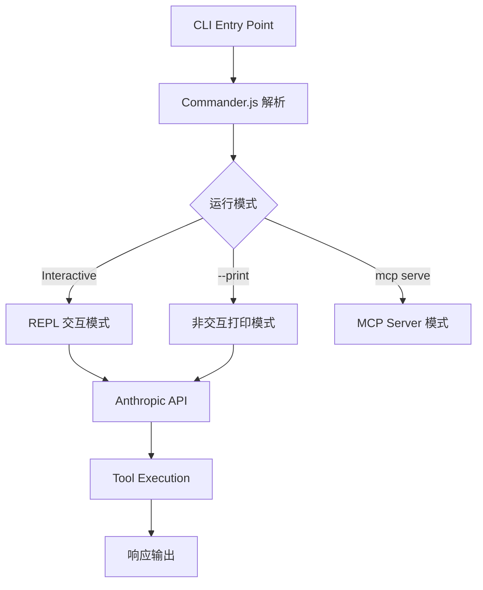
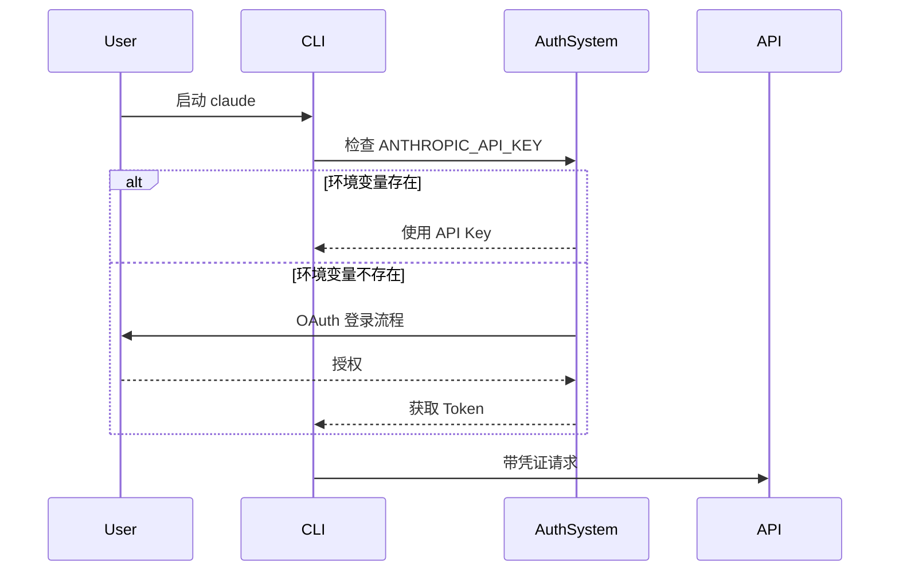
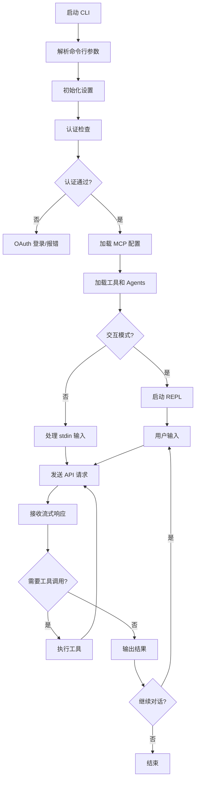

# Claude Code CLI 功能与业务流程分析

基于对 Claude cli.js（Version 2.1.2）的逆向分析结果。

---

## 核心架构概览



---

## 主要功能模块

### 1. 命令行入口（Entry Point）

| 位置 | 描述 |
|------|------|
| `main_function_start` (line 606582) | 主函数入口 |
| `$q7()` (line 606660) | Commander.js 初始化和选项解析 |

**支持的命令行选项：**

| 选项 | 描述 |
|------|------|
| `-p, --print` | 非交互模式，打印响应后退出 |
| `-c, --continue` | 继续最近的对话 |
| `-r, --resume` | 恢复指定会话 |
| `--model <model>` | 指定模型（如 sonnet, opus） |
| `--system-prompt` | 自定义系统提示 |
| `--mcp-config` | MCP 服务器配置 |
| `--dangerously-skip-permissions` | 跳过权限检查 |
| `--output-format` | 输出格式（text/json/stream-json） |
| `--max-turns` | 最大对话轮次 |
| `--allowed-tools` / `--disallowed-tools` | 工具白名单/黑名单 |

---

### 2. 认证流程



**认证来源：**
- `ANTHROPIC_API_KEY` 环境变量
- `CLAUDE_CODE_OAUTH_TOKEN` 环境变量
- OAuth 交互式登录

---

### 3. API 调用

**API 调用位置（共 7 处）：**
| 行号 | 上下文 |
|------|--------|
| 258592 | `this.client.beta.messages.create` |
| 318895 | 标准消息创建 |
| 468953 | 带重试机制调用 |
| 540282 | Vertex/Bedrock 支持 |
| 566884 | 流式响应处理 |
| 586394 | 工具调用响应 |
| 586993 | 最终响应返回 |

**API 特性：**
- 使用 `beta.messages.create` 接口
- 支持流式输出 (stream-json)
- 支持工具调用 (tool_use)
- 支持多云提供商（Anthropic、AWS Bedrock、Google Vertex）

---

### 4. MCP（Model Context Protocol）集成

MCP 服务器管理支持：
- 从 JSON 配置文件加载
- 动态注册工具
- SDK 类型和标准类型服务器
- 企业级配置覆盖

---

### 5. 客户端类型检测

```javascript
// 客户端类型判断逻辑 (line 606598-606612)
if (process.env.GITHUB_ACTIONS === "true") return "github-action";
if (process.env.CLAUDE_CODE_ENTRYPOINT === "sdk-ts") return "sdk-typescript";
if (process.env.CLAUDE_CODE_ENTRYPOINT === "sdk-py") return "sdk-python";
if (process.env.CLAUDE_CODE_ENTRYPOINT === "sdk-cli") return "sdk-cli";
if (process.env.CLAUDE_CODE_ENTRYPOINT === "claude-vscode") return "claude-vscode";
// ...
return "cli";
```

---

### 6. 工具系统

内置工具系统支持：
- 权限上下文管理
- 工具白名单/黑名单
- 结构化输出（JSON Schema）
- 自定义 Agent 配置

---

## 业务流程



---

## 关键依赖

| 依赖 | 用途 |
|------|------|
| Commander.js | CLI 框架 |
| RxJS | 响应式编程（流处理） |
| highlight.js | 代码语法高亮 |
| Ink (React) | 交互式终端 UI |

---

## 总结

Claude Code CLI 是一个功能完整的 AI 编程助手工具，主要特点：

1. **多模式运行**：支持交互式、批处理、SDK 集成等多种模式
2. **企业级特性**：支持多云部署、MCP 协议、权限管理
3. **可扩展性**：通过 MCP 和 Agent 系统支持自定义扩展
4. **安全性**：完整的认证和权限控制机制

> [!NOTE]
> 由于源码已压缩/混淆，具体的变量名和函数名无法还原。以上分析基于代码结构和可识别的字符串常量推导。
